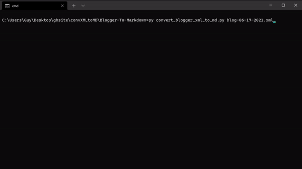

# Blogger Post To Markdown Converter


Convert your Blogger posts to Markdown for use with Ghost, Jekyll, and more. Created out of frustration other implementations simply don't work or have 1e25 dependencies. This implementation works and has ZERO external dependencies. 

## Usage

1. Backup Blogger posts to an XML file. 

   Instructions from https://support.google.com/blogger/answer/41387

   1. [Sign in to Blogger](https://www.blogger.com/).
   2. At the top left, select the blog you want to back up.
   3. In the left menu, click **Settings**.
   4. Under "Manage blog," click **Back up content** > **Download**.

2. Clone or download this repo and run

```cmd
py convert_blogger_xml_to_md.py "path/to/blogger/backup.xml"
```

## Features

- [x] No external dependencies
- [x] Automatically download images from posts
- [x] Over 25 HTML tags supported. Like `table`, `img`, `code`, `a`, `blockquote`, and more.
- [x] In-depth HTML to Markdown conversion. Including support converting nested and mixed unordered and ordered lists
- [x] Supports emojis
- [x] Extract posts' Author, Title, Tags, and Publish Date

## Configuration and Extensibility

The global dictionary `g_converter_config` can set save paths and converter behavior. Comments next to each setting document its use.

The `HTMLToMarkdownParser` class converts HTML to Markdown tag by tag. To extend or change the converter, you'll probably want to add or patch code in `HTMLToMarkdownParser.handle_starttag()` and `HTMLToMarkdownParser.handle_endtag()`. 

## Shortcomings

1. Converting `div`, `style`, `iframe`, `script` tags

   Converting a post from HTML, CSS, and JS to Markdown, which is graphically limited by design, inherently means there is information that can't be perfectly converted. As such, html-specific tags that don't exist in Markdown are either ignored (like `div`) or copied as-is (like `iframe`, `script`, `style`).

2. Image captions created in Blogger's editor

   Blogger uses an html `table` to couple captions to images. However, this conversion script doesn't (yet) support nesting images inside tables. Therefore, after conversion, captions aren't perfectly aligned to images.

3. Only tested converting my blog. This isn't battle-hardened code. Please create a Github issue if you run into any bugs.

Enjoy!
